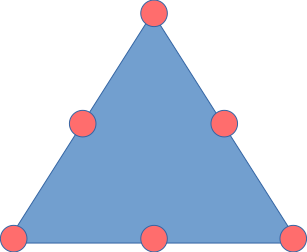
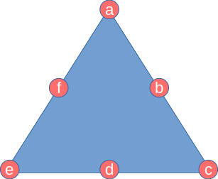
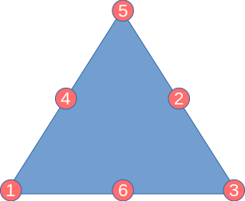
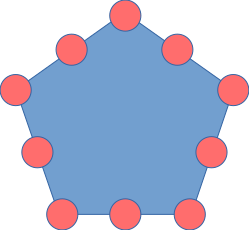
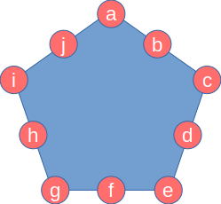

## Magic Triangles

I first saw this puzzle in [CSIRO](https://www.csiro.au/)'s [Double
Helix](https://doublehelixshop.csiro.au/)
[here](https://blog.doublehelix.csiro.au/a-magic-triangle-brainteaser/).

The [Magic Triangle](https://en.wikipedia.org/wiki/Magic_triangle_(mathematics))
problem we are solving is described as:

You are given a triangle with circle on each point and on each side:



Then, using the numbers from 1 to 6, arrange them in a triangle with three
numbers on each side. Swap them around until the sides all add up to the same
number.

Finally, sum each side to 10.

### Method

Let's label the triangle: starting from any vertex label the nodes:



The method to solve this problem is broken into the following steps:

  - get all permutations of numbers 1 to 6 as a, b, c, d, e, f

  - filter permutation to satisfy conditions:

    - `a + b + c == c + d + e == e + f + a`

    - and final condition: `a + b +c == 10`

#### Using Haskell

All permutations of numbers 1 to 6:

```haskell
import Data.List

permutations [1..6]
```

_This will give `6! = 720` permutations._

Filter on sides summing up to the same value:

```haskell
[
  [(a,b,c), (c,d,e), (e,f,a)] | [a,b,c,d,e,f] <- permutations [1..6],
    a+b+c == c+d+e &&
    c+d+e == e+f+a
]
```

Which gives all solutions where the sides are equal sums:

```text
  [(3,2,5),(5,4,1),(1,6,3)]
  [(2,4,3),(3,5,1),(1,6,2)]
  [(1,5,3),(3,4,2),(2,6,1)]
  [(1,4,5),(5,2,3),(3,6,1)]
  [(5,3,4),(4,2,6),(6,1,5)]
  [(6,2,4),(4,3,5),(5,1,6)]
  [(4,5,2),(2,3,6),(6,1,4)]
  [(6,3,2),(2,5,4),(4,1,6)]
  [(2,3,6),(6,1,4),(4,5,2)]
  [(4,1,6),(6,3,2),(2,5,4)]
  [(3,4,2),(2,6,1),(1,5,3)]
  [(1,6,2),(2,4,3),(3,5,1)]
  [(5,4,1),(1,6,3),(3,2,5)]
  [(4,3,5),(5,1,6),(6,2,4)]
  [(6,1,5),(5,3,4),(4,2,6)]
  [(3,6,1),(1,4,5),(5,2,3)]
  [(5,2,3),(3,6,1),(1,4,5)]
  [(2,6,1),(1,5,3),(3,4,2)]
  [(3,5,1),(1,6,2),(2,4,3)]
  [(1,6,3),(3,2,5),(5,4,1)]
  [(5,1,6),(6,2,4),(4,3,5)]
  [(2,5,4),(4,1,6),(6,3,2)]
  [(6,1,4),(4,5,2),(2,3,6)]
  [(4,2,6),(6,1,5),(5,3,4)]
```

Filter on sides summing to 10:

```haskell
[
  [(a,b,c), (c,d,e), (e,f,a)] | [a,b,c,d,e,f] <- permutations [1..6],
    a+b+c == 10 &&
    c+d+e == 10 &&
    e+f+a == 10
]
```

Which gives our final list of solutions:

```text
  [(3,2,5),(5,4,1),(1,6,3)]
  [(1,4,5),(5,2,3),(3,6,1)]
  [(5,4,1),(1,6,3),(3,2,5)]
  [(3,6,1),(1,4,5),(5,2,3)]
  [(5,2,3),(3,6,1),(1,4,5)]
  [(1,6,3),(3,2,5),(5,4,1)]
```

Note here that the solutions aren't unique: there are repetitions if you
consider rotations or node reversals. Can we filter these out to get the only
unique solution?

Try ordering:

```haskell
[
  [(a,b,c), (c,d,e), (e,f,a)] | [a,b,c,d,e,f] <- permutations [1..6],
    a+b+c == 10 &&
    c+d+e == 10 &&
    e+f+a == 10 &&
    a > c &&
    c > e
]
```

The idea here is that as the nodes are unique, we can order them. This yields
our final solution:

```text
  [(5,2,3),(3,6,1),(1,4,5)]
```

Using one other Haskell refinement we can write this as:

```haskell
[
  [(a,b,c), (c,d,e), (e,f,a)] | [a,b,c,d,e,f] <- permutations [1..6],
    all (==10) [a+b+c, c+d+e, e+f+a] &&
    a > c && c > e
]
```



Check your answer on CSIRO page
[here](https://blog.doublehelix.csiro.au/a-magic-triangle-brainteaser/#answer).

### Using Python

[Python](https://www.python.org/) now has [list
comprehensions](https://docs.python.org/3/tutorial/datastructures.html#list-comprehensions)
just like many
[other](https://en.wikipedia.org/wiki/Comparison_of_programming_languages_(list_comprehension))
programming languages, so the solution is much the same. Also, use the built-in
[permutations](https://docs.python.org/3/library/itertools.html#itertools.permutations)
function from [itertools](https://docs.python.org/3/library/itertools.html):

```python
import itertools

[
  [(a,b,c),(c,d,e),(e,f,a)]
    for a,b,c,d,e,f in list(itertools.permutations(range(1,7)))
      if a+b+c == 10 and c+d+e == 10 and e+f+a == 10
        and a > c and c > e
]
```

Which yields the same results as our previous solution in Haskell:

```text
  >>> [[(5, 2, 3), (3, 6, 1), (1, 4, 5)]]
```

## Magic Pentagons

In figure below the pentagon has 10 circles, 5 at each corner, 5 in the middles
of the edges. Place the numbers 1 to 10 in the circles so that each side sums to
the same value.



### Method

Find solutions where all sides sum to equal value. First label the corners:



Now, using a similar method to the magic triangles, search all permutations for
which the sums of sides are equal. Here we limit the search to just the first
result for a given sum total.

```haskell
import Data.List
import Data.Maybe

solve :: Int -> Maybe [(Int,Int,Int)]
solve n
    | null ns   = Nothing
    | otherwise = Just (head ns)
    where ns = [ [(a,b,c), (c,d,e), (e,f,g), (g,h,i), (i,j,a)]
                  | [a,b,c,d,e,f,g,h,i,j] <- permutations [1..10],
                    all (==n) [a+b+c, c+d+e, e+f+g, g+h+i, i+j+a] ]
```

Now solve for minimum sum of a side to maximum sum:

```haskell
-- solve for sums 10 to 27
solutions = map solve [10..27]
```

Technically we could restrict this range further as I just choose the minimum
and maximum of a side given the numbers 1..10.

And show solutions:

```haskell
-- show solutions
zip [10..27] solutions
```

Which gives the solutions as:

```text
10: Nothing
11: Nothing
12: Nothing
13: Nothing
14: Just [(3,6,5),(5,7,2),(2,8,4),(4,9,1),(1,10,3)]
15: Nothing
16: Just [(5,2,9),(9,4,3),(3,6,7),(7,8,1),(1,10,5)]
17: Just [(6,9,2),(2,7,8),(8,5,4),(4,3,10),(10,1,6)]
18: Nothing
19: Just [(8,5,6),(6,4,9),(9,3,7),(7,2,10),(10,1,8)]
20: Nothing
21: Nothing
22: Nothing
23: Nothing
24: Nothing
25: Nothing
26: Nothing
27: Nothing
```

See also other [solutions](files/maths-problems.ipynb) to problems. This use a
Jupyter notebook using [IHaskell](https://github.com/gibiansky/IHaskell). These
problems were kindly privided by my friend, Dr Stephen Weissenhofer of School of
Computing, Data and Mathematical Sciences at [Western Sydney
University](https://westernsydney.edu.au).
